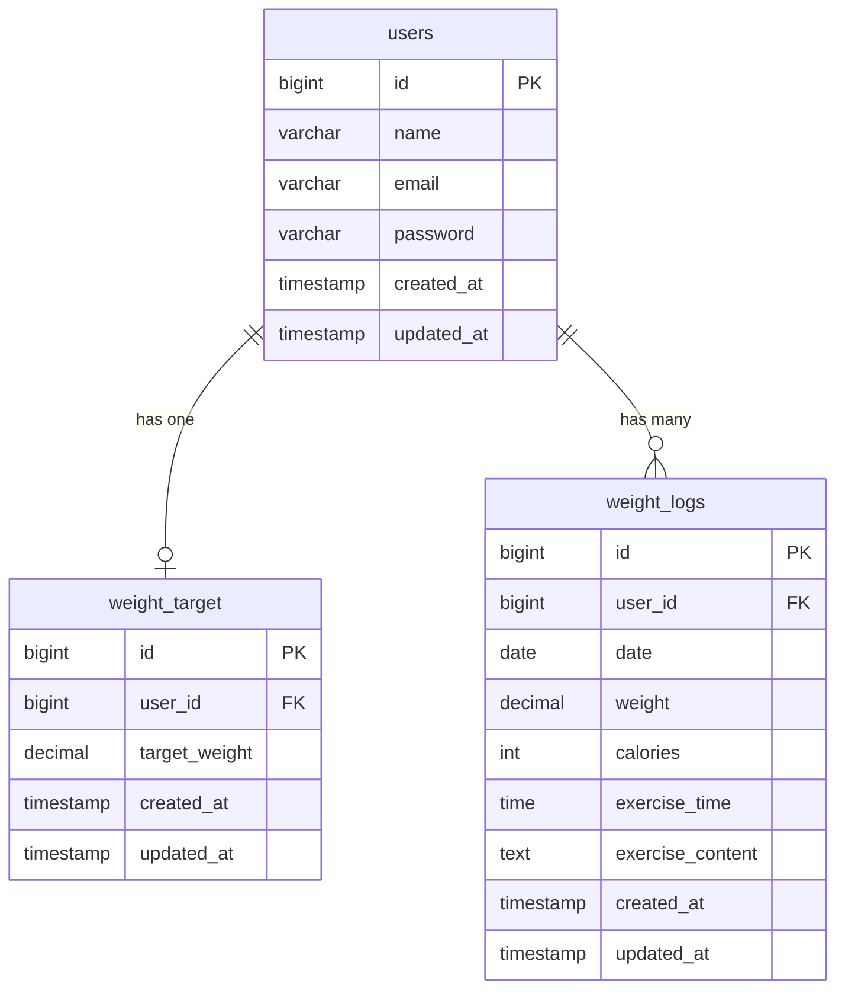

# PiGLy - 体重管理アプリ

## 概要
体重・摂取カロリー・運動時間・運動内容を記録・管理するLaravelアプリケーション。
日々の体重推移を一覧で確認し、目標体重に向けた健康管理をサポートします。

## ER図



## 環境構築

### 前提条件
- Docker がインストール済み
- Git がインストール済み

### セットアップ手順

```bash
# リポジトリをクローン
git clone https://github.com/sae0715/Pigry.git
cd Pigry

# Dockerビルド・起動
docker-compose up -d --build

# コンテナに入る
docker-compose exec php bash

# 依存パッケージをインストール
composer install

# 環境変数を設定
cp .env.example .env
php artisan key:generate

# データベースを初期化
php artisan migrate
php artisan db:seed
```

## 使用技術（実行環境）
- PHP 8.5.0
- Laravel 8.83.27
- MySQL 8.0
- Laravel Fortify（認証）
- Docker

## 開発環境URL
- リポジトリ：https://github.com/sae0715/Pigry.git
- アプリケーション：http://localhost
- phpMyAdmin：http://localhost:8080

## テストアカウント
| 項目 | 値 |
|------|-----|
| メールアドレス | test@example.com |
| パスワード | password |

## URL一覧
| メソッド | URL | 説明 |
|----------|-----|------|
| GET | / | ログインページへリダイレクト |
| GET | /login | ログイン画面 |
| POST | /login | ログイン |
| POST | /logout | ログアウト |
| GET | /register/step1 | 会員登録STEP1 |
| POST | /register/step1 | 会員登録STEP1送信 |
| GET | /register/step2 | 会員登録STEP2 |
| POST | /register/step2 | 会員登録STEP2送信 |
| GET | /weight_logs | 体重管理一覧 |
| POST | /weight_logs | 体重ログ登録 |
| GET | /weight_logs/search | 体重ログ検索 |
| GET | /weight_logs/goal_setting | 目標体重設定 |
| PUT | /weight_logs/goal_setting | 目標体重更新 |
| GET | /weight_logs/{id} | 体重ログ詳細 |
| PUT | /weight_logs/{id} | 体重ログ更新 |
| DELETE | /weight_logs/{id} | 体重ログ削除 |